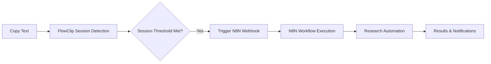

# 🚀 FlowClip N8N Integration Setup

**Complete guide to set up N8N automation with your FlowClip application**

## 📁 What's Included

Your FlowClip project now includes complete N8N integration:

```
FlowClip/
├── 📋 N8N_QUICK_START.md          # 5-minute setup guide
├── 📖 N8N_DEPLOYMENT_GUIDE.md     # Comprehensive deployment options
├── 🔧 scripts/
│   ├── deploy-n8n-local.sh        # Automated local setup
│   └── deploy-n8n-docker.sh       # Automated Docker setup
├── 🔗 src/services/
│   └── externalApiService.js      # N8N integration code
├── 🧪 test-n8n-integration.js     # Integration testing
└── 📝 n8n-workflow-examples.json  # Ready-to-import workflows
```

## 🎯 Quick Start (2 minutes)

**For immediate testing:**

```bash
# 1. Run automated setup
./scripts/deploy-n8n-local.sh

# 2. Start N8N  
./start-n8n-local.sh

# 3. Test integration
node test-n8n-integration.js
```

**✅ Done!** N8N is running at http://localhost:5678

## 🚀 Production Deployment

### Option 1: N8N Cloud (Recommended)
- ✅ **No server management** 
- ✅ **Built-in monitoring**
- ✅ **Automatic scaling**
- ⭐ **Free tier available**

[Sign up at n8n.cloud →](https://n8n.cloud)

### Option 2: Self-Hosted Docker
- ✅ **Full control**
- ✅ **Custom domain**
- ✅ **Data privacy**
- ✅ **Cost effective at scale**

```bash
./scripts/deploy-n8n-docker.sh
```

## 📋 FlowClip Workflows Included

| Workflow | Trigger | Automation Tasks |
|----------|---------|------------------|
| **🏨 Hotel Research** | 2+ hotel items | Price comparison, reviews, availability |
| **🛒 Product Research** | 3+ product items | Price tracking, feature comparison |
| **📚 Academic Research** | 4+ academic items | Paper discovery, citation analysis |
| **🍽️ Restaurant Research** | 2+ restaurant items | Menu analysis, reservations |
| **✈️ Travel Research** | 2+ travel items | Flight search, accommodations |
| **🔍 General Research** | 3+ general items | Web search, fact-checking |

## 🔧 How It Works



### Intelligent Session Detection
- **AI-Powered**: Uses LangGraph workflows to detect content types
- **No Hard-Coding**: Semantic analysis instead of keyword matching
- **Smart Grouping**: Related content automatically grouped together
- **Rate Limited**: Prevents automation spam

### N8N Automation
- **6 Session Types**: Each with specialized automation workflows
- **Rich Data Extraction**: Smart content analysis for each research type
- **External API Integration**: Google, Amazon, arXiv, TripAdvisor, etc.
- **Error Handling**: Retry mechanisms and graceful degradation

## 🔑 API Configuration

### Required for Full Functionality

Add these API keys to your N8N workflows:

```bash
# Search & Discovery
OPENAI_API_KEY=your_key       # Web search and AI processing
GOOGLE_API_KEY=your_key       # Custom Search

# E-commerce  
AMAZON_API_KEY=your_key       # Product search
EBAY_API_KEY=your_key         # Product listings

# Travel & Hospitality
TRIPADVISOR_API_KEY=your_key  # Hotel reviews
BOOKING_API_KEY=your_key      # Hotel prices

# Academic & Research
# arXiv API is free (no key needed)
# Academic search via OpenAI web search

# Fact-checking
SNOPES_API_KEY=your_key       # Fact verification
```

### Free Alternatives Available
- Web scraping nodes instead of paid APIs
- Public APIs where available
- Rate-limited free tiers

## 🧪 Testing Your Setup

### 1. Test N8N Deployment
```bash
# Check if N8N is running
curl http://localhost:5678/healthz

# Test webhook endpoints
./test-n8n-local.sh
```

### 2. Test FlowClip Integration
```bash
# Test complete integration
node test-n8n-integration.js

# Expected output:
# ✓ hotel_research session created and automation triggered
# ✓ product_research session created and automation triggered
```

### 3. Test Real Usage
1. Start FlowClip: `npm start`
2. Copy hotel research content (e.g., "Hilton Toronto Downtown")
3. Check Sessions tab for session creation
4. Verify N8N workflow execution

## 📊 Configuration Options

### Session Thresholds
Customize when automation triggers:

```javascript
// In src/services/externalApiService.js
workflowConfig = {
  hotel_research: {
    triggerThreshold: 2,    // 2+ items triggers automation
    timeout: 30000,         // 30 second timeout
    enabled: true
  },
  // ... other session types
}
```

### Rate Limiting
```javascript
// Default: 1 minute between automations per session
this.rateLimiter.set(sessionId, Date.now());
```

### Webhook Endpoints
```javascript
// Configurable webhook paths
hotel_research: '/flowclip-hotel-research'
product_research: '/flowclip-product-research'
// ... etc
```

## 🔒 Security Best Practices

### For N8N Cloud
- ✅ Use API keys for webhook authentication
- ✅ Enable workflow access restrictions
- ✅ Monitor execution logs regularly

### For Self-Hosted
- ✅ Enable SSL/TLS encryption
- ✅ Use strong admin passwords
- ✅ Configure firewall rules
- ✅ Regular security updates
- ✅ Backup encryption keys

## 📈 Monitoring & Maintenance

### N8N Cloud
- Built-in execution monitoring
- Email alerts for failures
- Usage analytics dashboard
- Automatic scaling

### Self-Hosted Docker
```bash
# Health checks
./health.sh

# View logs
./logs.sh -f

# Create backups
./backup.sh

# Monitor resources
docker stats
```

## 🆘 Troubleshooting

### Common Issues & Solutions

**❌ "Webhook not found" errors**
```bash
# Solution: Import FlowClip workflows
# 1. Open N8N interface
# 2. Import n8n-workflow-examples.json
# 3. Activate workflows
```

**❌ "Connection refused" errors**
```bash
# Check N8N status
curl http://localhost:5678/healthz

# For Docker deployments
docker-compose ps
docker-compose logs n8n
```

**❌ FlowClip not triggering automation**
```bash
# Check environment configuration
cat .env | grep N8N_WEBHOOK_ENDPOINT

# Enable debug logging
DEBUG=flowclip:n8n npm start
```

**❌ Rate limit or API errors**
- Configure retry mechanisms in N8N workflows
- Implement proper error handling
- Consider upgrading API plans

## 📞 Support Resources

- **📖 Full Documentation**: [N8N_DEPLOYMENT_GUIDE.md](N8N_DEPLOYMENT_GUIDE.md)
- **🚀 Quick Start**: [N8N_QUICK_START.md](N8N_QUICK_START.md)  
- **🧪 Example Code**: [test-n8n-integration.js](test-n8n-integration.js)
- **🔗 N8N Docs**: https://docs.n8n.io/
- **💬 N8N Community**: https://community.n8n.io/

## 🎉 What's Next?

Once your N8N integration is working:

1. **📈 Monitor Usage**: Track automation success rates and optimize thresholds
2. **🔧 Customize Workflows**: Modify example workflows for your specific needs  
3. **🌐 Add More APIs**: Integrate additional services for richer automation
4. **⚡ Scale Up**: Monitor performance and upgrade resources as needed
5. **🤝 Share Results**: Contribute improvements back to the FlowClip community

---

## 🏁 Ready to Start?

Choose your deployment option:

| Quick Test | Production |
|------------|------------|
| `./scripts/deploy-n8n-local.sh` | [N8N Cloud](https://n8n.cloud) or `./scripts/deploy-n8n-docker.sh` |
| 2 minutes setup | Full production features |
| Perfect for development | Scalable & reliable |

**🎯 Goal**: Turn FlowClip into your intelligent research automation assistant!

---

*Questions? Check the troubleshooting section above or refer to the comprehensive deployment guide.* 